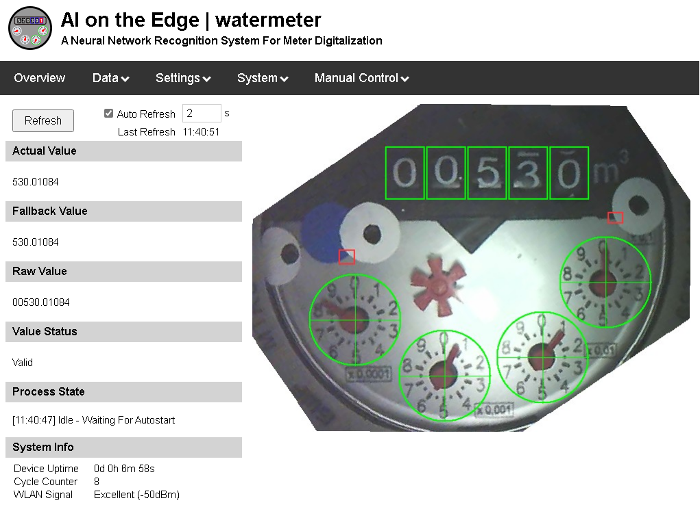
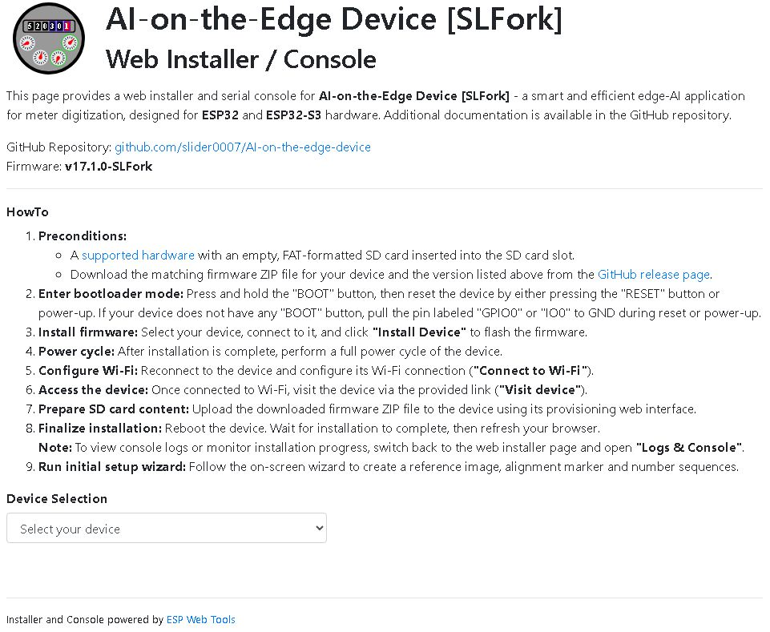

<h1>
  
  AI-on-the-Edge Device [SLFork]
</h1>

Artificial intelligence is everywhere — from speech recognition to image analysis. While traditional AI often relies on powerful cloud 
servers, **AI-on-edge** runs directly on compact, affordable devices. This project brings edge computing to your home by using a low-cost, 
AI-enabled device to digitize your analog meters — whether it's water, gas or electricity. With budget-friendly hardware and an easy setup, 
you can turn any standard meter into a smart, connected device.

## Key Features
- **Compact & Cost-Effective** – Designed for small, affordable, AI-capable hardware
- **Local Image Processing** – Fully processes and evaluates images on-device without external dependencies
- **On-Device AI** – TensorFlow enables efficient edge intelligence without external dependencies
- **Web-Based Interface** – Browser UI for monitoring, configuration and control
- **OTA Update** – Seamless over-the-air firmware updates via the web interface

### ✨ Fork-Specific Enhancements
- **[Hardware Support](#supported-hardware)** – Compatible with ESP32 and ESP32-S3 devices
- **Device Provisioning** - Web-based service for user-friendly firmware, SD card provisioning incl. Wi-Fi config
- **Connectivity** – Operates in WiFi Client, WiFi Access Point (Standalone) or Ethernet mode
- **Flashlight** – Fully customizable setup using one or multiple digital, PWM-driven or smart LEDs
- **Durability** – Minimizes SD card wear by keeping process data (ROIs, models, markers) in RAM
- **Performance** - Reduced I/O cycles (data kept in RAM) and hardware-optimized routines
- **User Experience** – Consistent UI, dynamic config reloads without reboot, improved error handling/logging
- **Configuration** – Firmware-managed JSON-based config for better maintainability and resilience
- **Codebase** – Streamlined, mostly consistently styled, easier to maintain
- **API Design** – Relevant APIs use JSON notation for seamless integration
- **TLS Support** – Secure connection supported for MQTT, InfluxDB and Webhook

Further refinements are documented in the [changelog](CHANGELOG.md) (v16.0.0-SLFork and newer).

## APIs & Integrations
- **[Home Assistant Integration](docs/API/MQTT/home-assistant-discovery.md)** – Automatic device discovery via MQTT
- **[REST API](docs/API/REST/_OVERVIEW.md)** – Retrieve live data, check device status, and issue control commands over HTTP
- **[MQTT v3](docs/API/MQTT/_OVERVIEW.md)** – Publish data to your MQTT broker (TLS supported)
- **InfluxDB v1 / v2** – Log data directly into time-series databases (TLS supported)
- **[Webhook Publishing](docs/API/Webhook/_OVERVIEW.md)** – Push content to external services via HTTP hook (TLS supported)
- **[Prometheus/OpenMetrics Exporter](docs/API/Prometheus-OpenMetrics/_OVERVIEW.md)** – Export metrics for device monitoring purposes

Explore API docs via links above or device web interface: `System > Documentation` 
ℹ️ APIs aren’t fully compatible with jomjol’s firmware.

## Workflow
The device captures an image of your meter at scheduled intervals and aligns it using predefined markers for accuracy. It then 
extracts the Regions of Interest (ROIs) from the image and processes these sections using AI. The extracted data is analyzed 
and converted into a digital reading, ready to be sent or accessed through various services and APIs (see above).

 

## Impressions
### Hardware
 

### Web Interface
 

## Supported Hardware
### Board Compatibility
| Board Type | SOC / Module | Network Interfaces | Flashlight | Firmware Support | Firmware Package | Remarks |
|:---|:---|:---|:---|:---|:---|:---|
| [ESP32-CAM](images/boards/esp32-cam.png) | ESP32 | 1. WiFi Client 2. WiFi AP | ✅ Onboard LED → Pin: GPIO4 (PWM) | All Releases | `esp32cam` | ⚠️ Only boards with ≥ 4MB RAM are supported |
| [XIAO ESP32S3 Sense](https://www.seeedstudio.com/XIAO-ESP32S3-Sense-p-5639.html) | ESP32S3 | 1. WiFi Client 2. WiFi AP | ❌ No Onboard LED: External LED required (PWM, SmartLED) → Pin (Configurable): GPIO1 (PWM) | ≥ v17.0.0  | `xiao-esp32s3-sense` | ⚠️ Small heatsink recommended |
| [Freenove ESP32S3-WROOM-N8R8](https://github.com/Freenove/Freenove_ESP32_S3_WROOM_Board) | ESP32S3-WROOM-1-N8R8 | 1. WiFi Client 2. WiFi AP | ⚠️ Onboard LED (Low intensity: External LED recommended (PWM, SmartLED)) → Pin: GPIO48 (SmartLED) | ≥ v17.1.0 | `freenove-esp32s3-n8r8` | ℹ️ SOC and pin-compatible boards with 8MB flash and 8MB RAM supported |
| [Freenove ESP32S3-WROOM-N16R8](images/boards/freenove-esp32s3-n16r8.png) | ESP32S3-WROOM-1-N16R8 | 1. WiFi Client 2. WiFi AP | ⚠️ Onboard LED (Low intensity: External LED recommended (PWM, SmartLED)) → Pin: GPIO48 (SmartLED) | ≥ v17.0.0 | `freenove-esp32s3-n16r8` | ℹ️ SOC and pin-compatible boards with 16MB flash and 8MB RAM supported |
| [ESP32-S3-CAM](images/boards/esp32s3-cam.png) | ESP32S3-WROOM-1-N16R8 | 1. WiFi Client 2. WiFi AP | ✅ Onboard LED → Pin: GPIO48 (SmartLED) | ≥ v17.4.0 | `freenove-esp32s3-n16r8` | ℹ️ Board is pin-compatible and identified as `freenove-esp32s3-n16r8` |
| [Waveshare ESP32S3-ETH](https://www.waveshare.com/esp32-s3-eth.htm) | ESP32S3 | 1. WiFi Client 2. WiFi AP 3. Ethernet | ❌ No Onboard LED: External LED required (PWM, SmartLED) → Pin (Configurable): GPIO17 (PWM) | ≥ v17.2.0  | `waveshare-esp32s3-eth` | ℹ️ POE supported (optional hardware required) |

### Camera Compatibility
| Camera Type | Sensor Resolution | Digital Zoom | Firmware Support | Remarks                       
|:---         |:---               |:---          |:---              |:---
| [OV2640](docs/Installation/ComponentDocu/Camera/OV2640/OV2640%20datasheet.pdf) | 2MP | 1.0x - 2.5x | All Releases |
| [OV3660](docs/Installation/ComponentDocu/Camera/OV3660/OV3660_CSP3_DS_1.3_sida.pdf) | 3MP | 1.0x - 3.2x | ≥ v17.4.0 |
| [OV5640](docs/Installation/ComponentDocu/Camera/OV5640/OV5640%20datasheet.pdf) | 5MP | 1.0x - 4.0x | ≥ v17.0.0 |ℹ️ Variant with autofocus is not supported

#### ⚠️ Important Note
The camera clock frequency — configurable via the WebUI or config file — may negatively impact wireless network performance. This can 
result in slower WebUI loading times or increased latency, particularly when using low-quality boards or those with onboard antennas. 
To optimize performance, experiment with different camera clock frequencies while evaluating both network responsiveness and resulting 
image quality. The ideal setting may vary depending on your specific hardware setup and the Wi-Fi channel in use.

## Firmware Installation

There are several convenient options to install the firmware and prepare the SD card content.

### Download Firmware
- **Releases** - Official firmware releases are available on the **[GitHub Releases Page](https://github.com/slider0007/AI-on-the-edge-device/releases)** 
- **Development Builds** - You can also test the latest development build / upcoming release via pull request labeled
[autorelease: pending](https://github.com/Slider0007/AI-on-the-edge-device/pulls?q=is%3Aopen+is%3Apr+label%3A%22autorelease%3A+pending%22). 
Follow the instructions at the bottom of the pull request to download the corresponding precompiled development build.

⚠️ **Important:** Do **not** use source files directly from the repository — this includes SD card preparation. Always use the official 
precompiled release packages or GitHub CI precompiled development builds. Using any of the source files may result in incomplete or 
non-functional firmware.

---
### Over The Air (OTA) Update
Once the initial installation is complete, it is **strongly recommended** to perform all future firmware updates via the **device’s 
web interface**: `System > OTA Update`. This method ensures seamless upgrades with minimal risk.

---
### Option 1: Web Installer (Only For Releases)

For the easiest and most user-friendly setup, use the **[Web Installer](https://slider0007.github.io/AI-on-the-edge-device/)**. 
Follow the step-by-step instructions on the Web Installer page. For more details, see the 
[Web Installer Provisioning Guide](docs/Installation/DeviceProvisioning/WebInstaller.md).

---
### Option 2: Manual Installation (MCU + SD Card)
Follow the steps in the [Manual Provisioning Guide](docs/Installation/DeviceProvisioning/Manual.md) to flash the MCU and 
prepare the SD card manually.

## Build Yourself
Developers and advanced users can build the firmware from source. Follow the [build / debug Instructions](code/README.md) for environment setup, firmware compilation and debugging. If you don’t need to customize the firmware, it’s easier to use the precompiled releases provided on the 
[Releases page](https://github.com/slider0007/AI-on-the-edge-device/releases).

## Support / Community
ℹ️ This is a fork of [jomjol’s project](https://github.com/jomjol/AI-on-the-edge-device), customized for personal use.

- It is **actively developed and maintained** independently
- It is **no longer compatible** with the upstream project
- It still uses the core principle of [jomjol’s project](https://github.com/jomjol/AI-on-the-edge-device) — make sure to **respect the upstream license**
- It remains public to give something back to the community and help others with similar use cases
- Customized code can be used for **non-commercial purposes** - be fair and **credit the original source**
- Community discussions, feedback and bug reports are always welcome and appreciated

Although no longer working on the upstream project, this version aims to provide a flexible and robust alternative.  
Thanks for your interest and support!

## Further Documentation
Some generic documentation can be found in [documentation repository](https://jomjol.github.io/AI-on-the-edge-device-docs/) of upstream project. 
⚠️ Not every description is 100% suitable for this fork. Fork-specific documentation is located in [docs](/docs/) folder of this repository.
