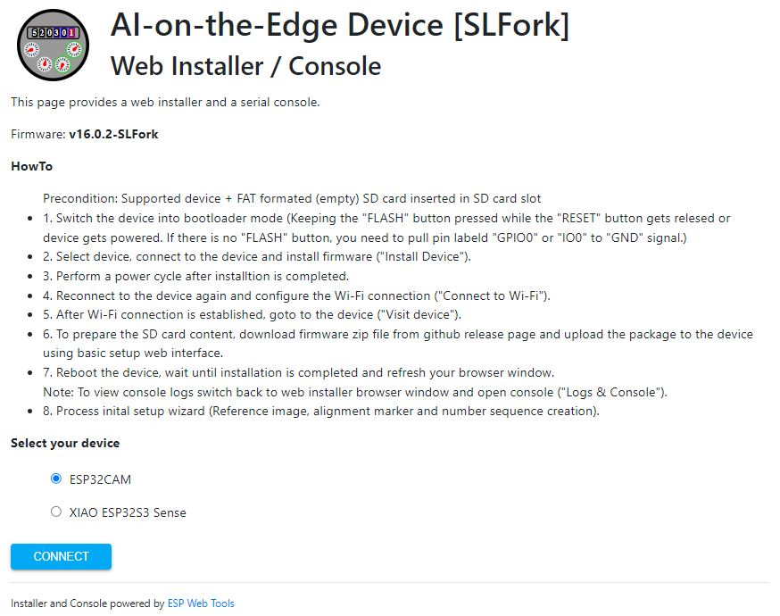

# AI-on-the-Edge Device [SLFork]
 

Artificial intelligence is everywhere, from speech to image recognition. While most AI systems rely on powerful processors or cloud computing, **edge computing** brings AI closer to the end user by utilizing the capabilities of modern processors.  
This project demonstrates edge computing using a low-cost, AI-capable Espressif SOC device (e.g. **ESP32**), to digitize your analog meters — whether water, gas or electricity. With affordable hardware and simple instructions, you can turn any standard meter into a smart device.

Let's explore how to make **AI on the Edge** a reality!

## Key features
- Tensorflow Lite (TFLite) integration – including easy-to-use wrapper
- Inline image processing (Image taking, Image alignment, ROI extraction, Post processing)
- Usage of **small** and **low-cost** AI-capable devices ([Supported Hardware](#supported-hardware))
- Integrated camera and illumination (depending on hardware capabilities)
- Web interface for visualization, control and administration 
- Over the air (OTA) firmware update via web interface

## APIs / Publishing Services / Home Automation Integrations
- Home Assistant Integration ([Home Assistant Discovery](docs/API/MQTT/home-assistant-discovery.md))
- [REST API](docs/API/REST/_OVERVIEW.md)
- [MQTT v3](docs/API/MQTT/_OVERVIEW.md)
- InfluxDB v1
- InfluxDB v2
- [Webhook Publishing](docs/API/Webhook/_OVERVIEW.md)
- [Prometheus/OpenMetrics Exporter](docs/API/Prometheus-OpenMetrics/_OVERVIEW.md)

## Workflow
The device takes an image of your meter at a defined interval. It extracts the Regions of Interest (ROIs) from the image and runs them through artificial intelligence. 
As a result, you get the digitized value of your meter. There are several options for what to do with that value. Either send it to a MQTT broker, write it to InfluxDB or simply provide access to it via a REST API (JSON / HTML).

 

## Impressions
### Hardware
 

### Web Interface
 

## Supported Hardware
| Board Type                                                                     | SOC      | Firmware Release | Remarks                       
|:---                                                                            |:---      |:---           |:--- 
| [ESP32-CAM](http://www.ai-thinker.com/pro_view-24.html)                        | ESP32    | All           | - Only boards with >4MB RAM are supported - Beware of inferior quality Chinese clones
| [XIAO ESP32 Sense](https://www.seeedstudio.com/XIAO-ESP32S3-Sense-p-5639.html) | ESP32S3  | $\ge$ v17.0.0 |- No onboard illumination: Separate illumination (PWM controlable LED / Intelligent LED) necessary - Running quite hot, small heat sink recommended

## Inform Yourself
There is growing [documentation](https://jomjol.github.io/AI-on-the-edge-device-docs/) which provides you with a lot of information. Head there to get a start, how to set it up and configure it. 
⚠️ Not every description is 100% suitable for this fork. Therefore please check `docs` folder of this repository for any fork specific documentation.

Small selection of youtube videos which might give you an idea how to getting started: [Video 1](https://www.youtube.com/watch?v=HKBofb1cnNc), [Video 2](https://www.youtube.com/watch?v=yyf0ORNLCk4), [Video 3](https://www.youtube.com/watch?v=XxmTubGek6M), [Video 4](https://www.youtube.com/watch?v=mDIJEyElkAU), [Video 5](https://www.youtube.com/watch?v=SssiPkyKVVs), [Video 6](https://www.youtube.com/watch?v=MAHE_QyHZFQ), [Video 7](https://www.youtube.com/watch?v=Uap_6bwtILQ)

## Firmware installation

There are multiple options to install the firmware and the SD card content.

### Download Firmware Package
Officially released firmware packages can be downloaded from [releases](https://github.com/slider0007/AI-on-the-edge-device/releases) page. 
A possibly already available development version (upcoming release version) can be previewed [here](https://github.com/Slider0007/AI-on-the-edge-device/pulls?q=is%3Aopen+is%3Apr+label%3A%22autorelease%3A+pending%22).

⚠️ **Please do not use the source files directly from the repository, not even for the preparation of the SD card!** Use only files related to the download sources mentioned here (official precompiled release packages or test versions). Otherwise, full functionality cannot be guaranteed. 

### Option 1: Web Installer (Only For Released Versions)

Follow the instructions listed at [Web Installer](https://slider0007.github.io/AI-on-the-edge-device/) page. 
Further details can be found in [Web Installer Provisioning Documentation](docs/Installation/DeviceProvisioning/WebInstaller.md).

---
### Option 2: Manual Installation (MCU + SD Card)
Further details can be found in [Manual Provisioning Documentation](docs/Installation/DeviceProvisioning/Manual.md).

## API Description
### REST API
See [REST API Documentation](docs/API/REST/_OVERVIEW.md) in github repository or via device web interface (`System > Documentation > REST API`). 
⚠️ Read API documenation carefully. REST API is not fully compatible with jomjol's original firmware.

### MQTT API
See [MQTT API Documentation](docs/API/MQTT/_OVERVIEW.md) in github repository or via device web interface (`System > Documentation > MQTT API`). 
⚠️ Read API documenation carefully. Webhook API is not fully compatible with jomjol's original firmware.

### Prometheus Exporter
See [Prometheus API Documentation](docs/API/Prometheus-OpenMetrics/_OVERVIEW.md) in github repository or via device web interface (`System > Documentation > Prometheus API`). 
⚠️ Read API documenation carefully. Prometheus API is not fully compatible with jomjol's original firmware.

### Webhook API
See [Webhook API Documentation](docs/API/Webhook/_OVERVIEW.md) in github repository or via device web interface (`System > Documentation > Webhook API`). 
⚠️ Read API documenation carefully. Webhook API is not fully compatible with jomjol's original firmware.

## Build Yourself
See [Build / Debug Instructions](code/README.md)

## Support
⚠️ This is a forked version of [jomjol´s great software](https://github.com/jomjol/AI-on-the-edge-device) which is intented to use for my personal purposes only.
