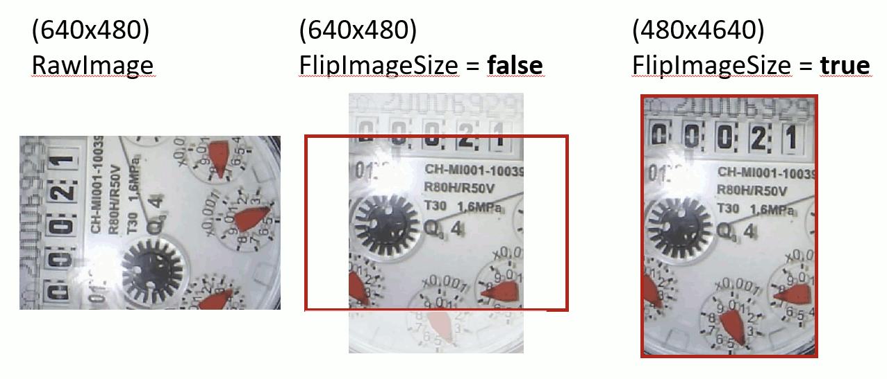

# Parameter: Flip Image Size

|                   | WebUI               | Firmware
|:---               |:---                 |:----
| Parameter Name    | Flip Image Size     | FlipImageSize
| Default Value     | `false`             | `false`
| Input Options     | `false` `true`   | `false` `true` 

## Description

Flip the image size (e.g. 640 x 480 -> 480 x 640).
Benefit: Do not loose image data when image gets rotated.
 
  

!!! Tip
    This parameter should be set on the 'Reference Image' configuration page.
    There you have a visual feedback.
