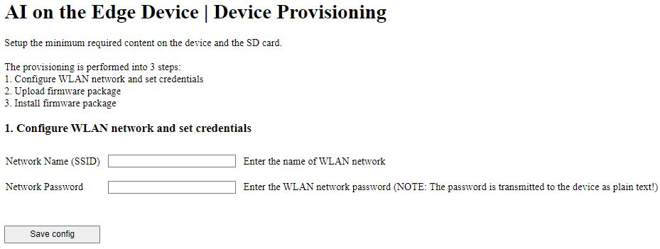
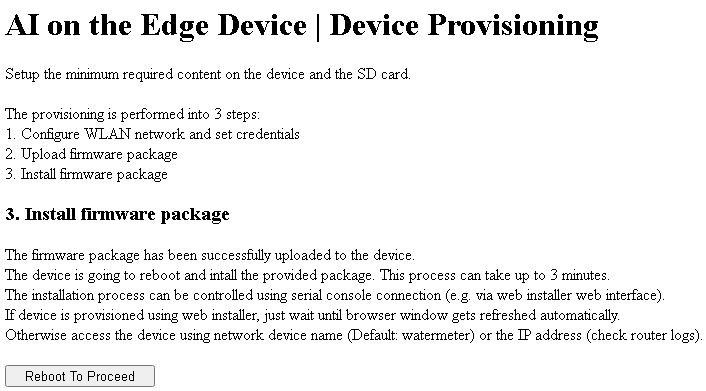
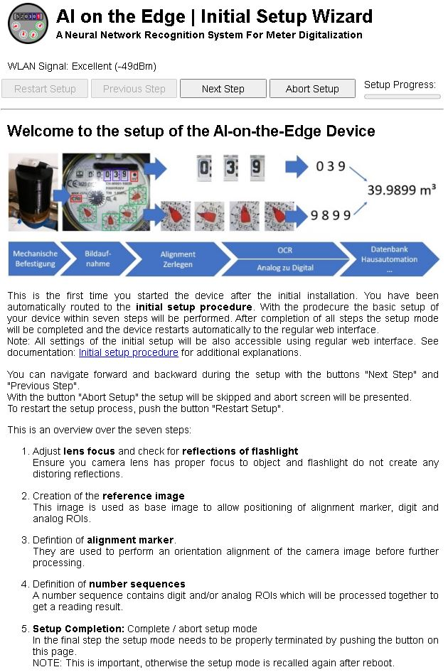

## Device Provisioning

### Access Point
1. Connect to device's WLAN access point `AI-on-the-Edge` (WLAN Channel 11 | Open Network | DHCP Server enabled)

2. Browse to http://192.168.4.1 and follow the instructions 
2.1. Provide WLAN configuration and credentials 
 
2.2. Upload firmware package (download from github release page, e.g. `AI-on-the-edge-device__{Board Type}__*.zip`) 
 
2.3. Install firmware package 

3. Reconnect to your own WLAN network and wait until device is connected to configured network.

4. Reload page, browse device network name or IP address (check router logs) 
Please follow the instruction of 'Inital Setup Wizard':

Compare also [jomjol documentation](https://jomjol.github.io/AI-on-the-edge-device-docs/Installation/#remote-setup-using-the-built-in-access-point).
:warning: Be aware, not all content is 