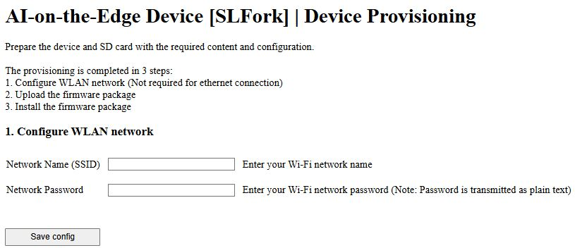

## SD Card Provisioning

**Precondition**: Insert a **formatted and empty SD card** into the device, and power it on with the 
firmware already flashed to the MCU.

---

### Option 1 (Preferred): Via Web Installer

Follow the instructions in the [Web Installer guide](WebInstaller.md), starting from **Step 5**.

---

### Option 2: Via Access Point  
*(Usable only if no ethernet connection is already established)*

1. Connect to the device’s WLAN access point:  
   **SSID:** `AI-on-the-Edge Device`
   - Channel: 11
   - Open Network (no password)
   - DHCP server enabled

2. Open your browser and go to [http://192.168.4.1](http://192.168.4.1), then follow the steps below:

   **2.1.** Provide WLAN credentials:  
   

   **2.2.** Upload the firmware package  
   *(Download from the GitHub release page, e.g., `AI-on-the-edge-device__{Board Type}__*.zip`)*  
   

   **2.3.** Start the installation process  
   

3. The device will reboot and install the necessary content. Once the process is complete, the device 
will automatically connect to the configured **Wi-Fi** or **Ethernet** network (default: DHCP).

4. Reload the page or access the device using one of the following:
   - Hostname: [http://watermeter](http://watermeter)
   - mDNS: [http://watermeter.local](http://watermeter.local)
   - Or check your router logs to find the assigned IP address

   You will be guided through the **Initial Setup Wizard**:  
   
