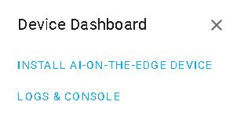
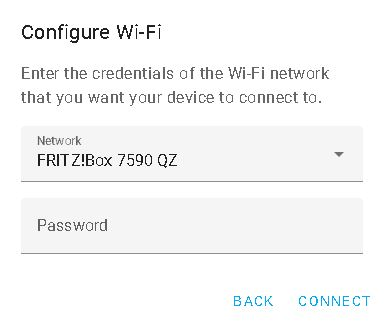
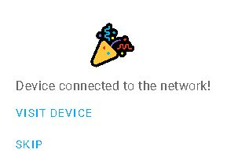
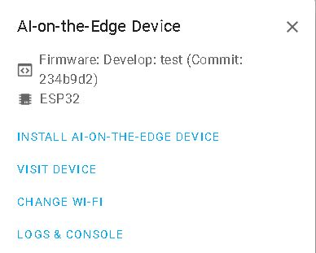
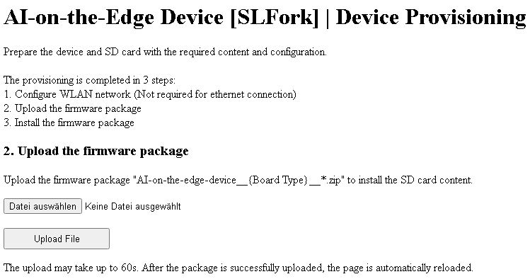
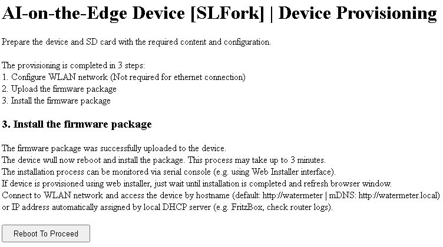
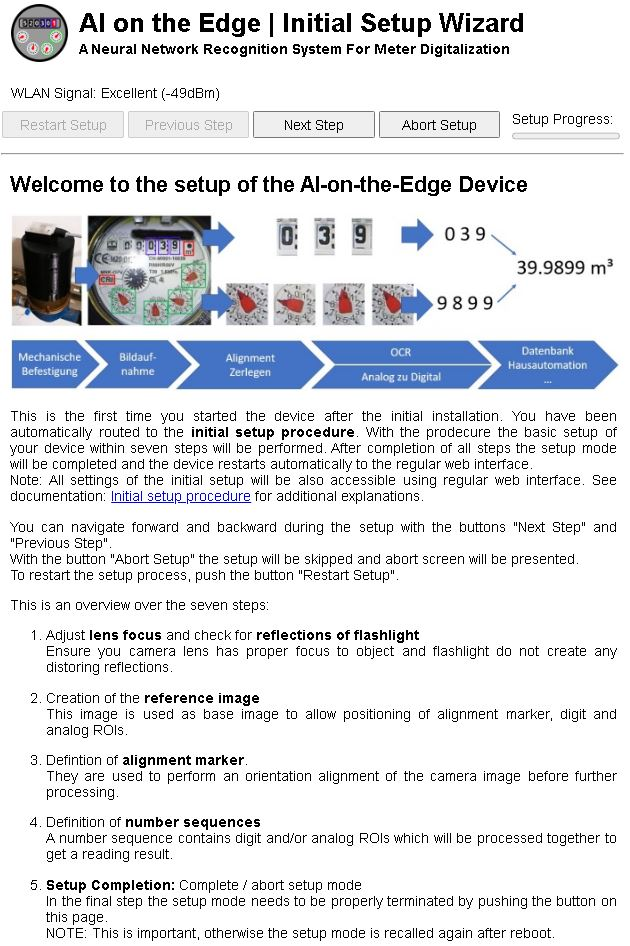

## Device Provisioning

### Web Installer (Recommended)

Provisioning your AI-on-the-Edge device can be done easily through the Web Installer. This method allows you to flash the firmware, configure the device, and upload the necessary SD card content — all from your browser.

👉 Open the [Web Installer](https://slider0007.github.io/AI-on-the-edge-device/) to begin.  

---

### Preconditions

Before starting the provisioning process, make sure the following are ready:

- ✅ A [supported hardware device](../../../README.md#supported-hardware)
- ✅ A **formatted** (FAT or FAT32) and **empty** SD card inserted into the device
- ✅ Downloaded the correct firmware ZIP file for your board from the [GitHub Release Page](https://github.com/slider0007/AI-on-the-edge-device/releases)
- ✅ Chrome or Edge browser (required for USB access via Web Serial API)

---

### Step-by-Step Provisioning Guide

#### **Step 1: Enter Bootloader Mode**
- Press and **hold the `BOOT` button**
- While holding `BOOT`, press the `RESET` button or power cycle the device
- If your device lacks a `BOOT` button, connect **GPIO0 (IO0)** to **GND** during reset/power-up

---

#### **Step 2: Connect and Flash Firmware**
- In the Web Installer, click **"Select device"**, choose your USB port, then click **"Install Device"**
- This will flash the firmware to your MCU  

---

#### **Step 3: Power Cycle the Device**
- Once firmware flashing is complete, **fully power cycle** the device (disconnect and reconnect power)

---

#### **Step 4: Configure Network**
> 📡 Skip this step if using ethernet connection — the device will use DHCP via ethernet by default.

##### 4.1 Scan Wi-Fi Networks  
- Reconnect to the device via the Web Installer  
- Click **"Scan for networks"** to list available Wi-Fi access points  

##### 4.2 Connect to Wi-Fi  
- Enter your Wi-Fi credentials and click **"Connect to Wi-Fi"**  

---

#### **Step 5: Access the Device Interface**
- Once connected to your network, click **"Visit Device"** to open the web interface  

- You can also access the device via:
  - Hostname: [http://watermeter](http://watermeter)
  - mDNS: [http://watermeter.local](http://watermeter.local)
  - IP Address (check your router for assigned address)

---

#### **Step 6: Upload SD Card Content**
- In the device provisiong interface, upload the **firmware ZIP file** (same file used for flashing)  

---

#### **Step 7: Install SD Card Content**
- Click **"Install"** to begin provisioning the SD card  
- This step may take a few minutes  

---

#### **Step 8: Reboot and Complete Setup**
- The device will reboot after SD card installation is complete  
- Refresh your browser or revisit the device (compare Step 5)  
- Optional: You can monitor installation progress or view logs in the Web Installer under **"Logs & Console"**

---

#### **Step 9: Run Initial Setup Wizard**
- Once the device is up, the **Initial Setup Wizard** will guide you through:
  - Creating a reference image
  - Defining the alignment marker
  - Setting up number sequences (digit detection)  

