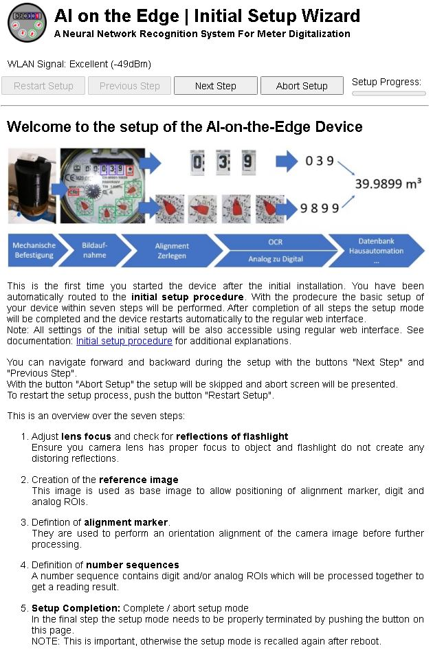

## Device Provisioning

### Web Installer
Please follow the instructions mentioned here:

#### Workflow Step 2: Initial connection to flash firmware

#### Workflow Step 4: Connection to device with firmware flashed, but no WLAN configured yet

#### Workflow Step 4.1: Scan for WLAN networks

#### Workflow Step 5: Connection to device

#### Workflow Step 6: 

#### Workflow Step 7: 

#### Workflow Step 8:
Please follow the instruction of 'Inital Setup Wizard':
